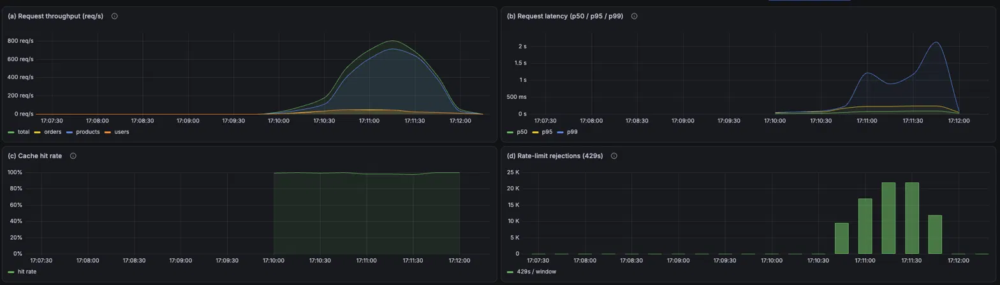

# API Gateway

A production-shaped reverse-proxy **API gateway** built in Python (FastAPI), with
Redis-backed rate limiting, response caching, and full Prometheus/Grafana
observability — all runnable with a single `docker compose up`.

> Built as a deep-dive into backend/systems engineering: the goal was to understand
> *why* every design decision was made, not just to make it work.

---

## Demo



*Live dashboards showing throughput, p99 latency, cache hit rate, and the rate
limiter shedding traffic under a burst load test.*

---

## What it does

Every client request hits the gateway first, which runs a short pipeline before
(optionally) forwarding to a backend service:

- **Reverse proxy / routing** — path-based routing to multiple backend services.
- **Rate limiting** — two interchangeable algorithms (token bucket & sliding
  window log), enforced atomically via Redis Lua scripts; returns HTTP 429 with a
  `Retry-After` header when a client exceeds its limit.
- **Response caching** — caches successful (200) GET responses in Redis with a TTL;
  reports `X-Cache: HIT`/`MISS`; query-string-aware cache keys.
- **Observability** — exposes Prometheus metrics (throughput, latency histogram for
  p50/p95/p99, cache hit/miss, rate-limit rejections); visualized in Grafana.

---

## Architecture

```
                     ┌─────────────────────────────────────┐
   Clients ─────────▶│             API GATEWAY             │
                     │                                     │
                     │  rate limit → cache → route/forward │
                     └──────┬──────────┬──────────┬────────┘
                            │          │          │
                     ┌──────▼──┐ ┌─────▼───┐ ┌────▼────┐
                     │ users   │ │ orders  │ │products │   (backend services)
                     │  :8001  │ │  :8002  │ │  :8003  │
                     └─────────┘ └─────────┘ └─────────┘
                            │
                     ┌──────▼──┐        ┌───────────────┐
                     │  Redis  │        │  Prometheus   │
                     │ counters│◀──────▶│      +        │
                     │ + cache │        │   Grafana     │
                     └─────────┘        └───────────────┘
```

<!-- TODO: optionally replace this ASCII diagram with a nicer image at
     docs/architecture.png -->

---

## Tech stack

**Language:** Python 3.12 · **Web:** FastAPI · **HTTP client:** httpx ·
**Data store:** Redis (atomic Lua scripts) · **Observability:** Prometheus, Grafana ·
**Load testing:** k6 · **Containerization:** Docker, Docker Compose

---

## Quick start

The entire stack (gateway, 3 backend services, Redis, Prometheus, Grafana) runs
with one command:

```bash
docker compose up -d
```

Then:

| Service | URL |
|---|---|
| Gateway | http://localhost:8000 |
| Prometheus | http://localhost:9090 |
| Grafana | http://localhost:3000 |

Try it:

```bash
curl http://localhost:8000/products/1      # routed to products service
curl http://localhost:8000/products/1      # again → served from cache (X-Cache: HIT)
```

Stop everything:

```bash
docker compose down
```

---

## Benchmarks

A single 90-second [k6](loadtest/gateway_load_test.js) run against the full
containerized stack, combining steady mixed traffic with a burst that
deliberately overwhelms the rate limiter.

**Throughput & correctness**
- **53,549 requests** in 90s, averaging **~595 req/s**
- **100%** of checks passed — every response was a valid `200` or an intentional `429`
- **~99.5% cache hit rate** (16,700 hits / 90 misses — *inflated by repetitive test traffic; see limitations*)

**Latency** — median **199 ms** · p95 **473 ms** · p99 **2.85 s** · max 4.64 s

**Rate limiter under burst (resilience)**
- Shed **38.6% of traffic — 20,657 requests returned `429`** — shielding the
  backends while the burst hammered a single endpoint.
- p99 rose to ~2.85 s *during the burst*: graceful degradation under deliberate
  overload — exactly what the limiter exists to contain.
- The burst *offered* 1,500 req/s, but **k6 itself hit its 400-VU ceiling** and
  dropped ~11k iterations — the bottleneck was the load generator, not the gateway.

> `http_req_failed` reads 38.57%, but those are the **intentional** rate-limit
> `429`s — the checks (which accept `200` *or* `429`) passed 100%. "38% failed"
> means "38% correctly rate-limited," not errors.

Full breakdown and the raw k6 summary: **[docs/benchmarks.md](docs/benchmarks.md)**.

---

## Design decisions & trade-offs

A few of the more interesting choices (full write-up in
[docs/DESIGN.md](docs/DESIGN.md)):

- **Atomic rate limiting via Redis Lua scripts.** The token bucket's
  read-refill-check-write sequence is a race condition waiting to happen — two
  concurrent requests could both read the same token count and both be allowed.
  Wrapping the whole sequence in a Lua script makes it atomic, so the limiter
  can't be defeated by concurrency. Validated with a concurrent load test.
- **Two rate-limiting algorithms, switchable via a constant.** Token bucket allows
  bursts; sliding window enforces a smoother limit. Implementing both demonstrates
  the accuracy/burst-tolerance trade-off.
- **Lazy, proportional token refill.** Tokens are refilled on-demand at request time
  (elapsed × rate), avoiding any background timer.
- **Cache key = path + query string, shared across users.** Correct because responses
  are user-independent; user-specific endpoints would need the client in the key.

---

## Known limitations & future work

Documented deliberately — these are conscious scoping decisions, not oversights:

- **Circuit breaker: designed but not implemented.** The failure-handling point (the
  backend call) is identified; scoped out to prioritize observability and polish.
- **GET-only forwarding.** Generalizing to all HTTP methods is a straightforward
  extension.
- **Gateway relays body but not backend status codes** (only 200s are cached, so this
  is currently benign).
- **Rate limiting keyed by IP** — imperfect (shared IPs, changing IPs); production
  would key on an API key once auth exists.
- **Cache invalidation is TTL-based only** — active invalidation on writes is the next
  step.
- **Benchmark cache hit rate is inflated** by repetitive test traffic; a realistic
  test would spread across many distinct resources.

---

## Project structure

```
api-gateway/
├── src/
│   ├── gateway/          # the gateway (routing, rate limit, cache, metrics)
│   └── services/         # dummy backend services (users, orders, products)
├── monitoring/           # prometheus.yml, grafana config
├── loadtest/             # k6 load test scripts
├── docs/                 # DESIGN.md, benchmarks.md, screenshots
├── docker-compose.yml
├── requirements.txt
└── README.md
```
