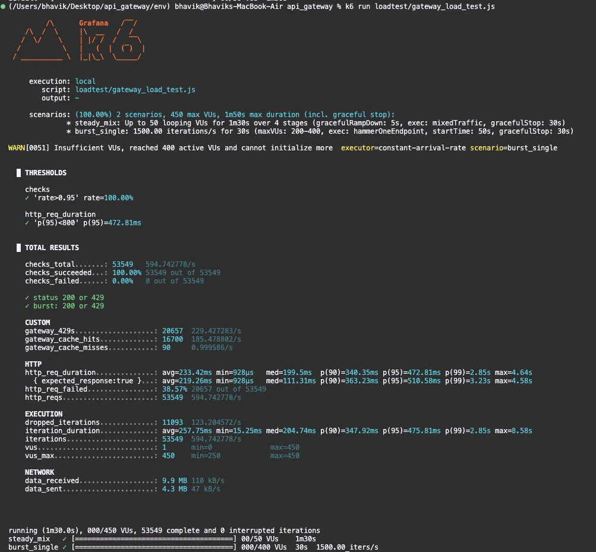

# Benchmarks

Load test run with [k6](https://k6.io) against the full containerized stack
(`docker compose up`), driving traffic through the gateway to the three backend
services with Redis-backed rate limiting and caching active.

Script: [`loadtest/gateway_load_test.js`](../loadtest/gateway_load_test.js).

## Test setup

**One 90-second run, two overlapping k6 scenarios:**

- **`steady_mix`** — ramps 0 → 50 virtual users over 90s (closed model), mixing
  `/users/1`, `/orders/2`, `/products/1`. Represents healthy traffic.
- **`burst_single`** — starts at 50s: an open-model **constant arrival rate of
  1,500 req/s for 30s**, hammering a single endpoint (`/products/1`) to
  deliberately overwhelm the rate limiter.

**Rate limiter loosened for the run:** `CAPACITY = 1000`, `REFILL_RATE = 600`
(the committed default is `10 / 1.0`). The loosened setting lets most steady
traffic through — so the proxy + cache path is actually exercised — while the
1,500 req/s burst still comfortably trips the limiter.

All services (gateway, 3 backends, Redis, Prometheus, Grafana) ran as containers
on one Compose network.

## Raw k6 summary

## Results

### Throughput & correctness
| Metric | Value |
|---|---|
| Total requests | **53,549** (~**595 req/s** over 90s) |
| Checks passed | **100%** (53,549 / 53,549) — "status is 200 or 429" |
| Data transferred | 9.9 MB received · 4.3 MB sent |

### Latency (`http_req_duration`, aggregate)
| avg | median | p90 | p95 | p99 | max |
|---|---|---|---|---|---|
| 233 ms | 199 ms | 340 ms | **473 ms** | **2.85 s** | 4.64 s |

The `p(95) < 800ms` threshold passed at **473 ms**. The p99 of 2.85 s reflects
the burst window (see interpretation below).

### Rate limiting
| Metric | Value |
|---|---|
| `http_req_failed` | **38.57%** (20,657) |
| `gateway_429s` (custom counter) | **20,657** |

Every "failure" is an intentional **429**. The k6 checks treat `200` *or* `429`
as correct (a 429 is the limiter doing its job) and passed **100%**. So the
honest reading of "38.57% failed" is **"38.57% correctly rate-limited."**

### Caching
| Metric | Value |
|---|---|
| `gateway_cache_hits` | 16,700 |
| `gateway_cache_misses` | 90 |
| Hit rate | **~99.5%** |

The near-perfect hit rate is **inflated by the test**: it repeats a tiny set of
paths, so almost everything is served warm. A realistic workload spread across
many distinct resources would show a lower, more honest hit rate.

### Load-generator limit
k6 warned `Insufficient VUs, reached 400 active VUs and cannot initialize more`
and dropped **11,093 iterations**. The burst *offered* 1,500 req/s but couldn't
sustain it — the **load generator was the bottleneck, not the gateway**.

## What the run demonstrates

- **Healthy phase (0–50s):** steady mixed traffic flows through routing → cache →
  backends; cache hits dominate and latency stays low.
- **Burst phase (50–80s):** a single endpoint is hammered far past the limiter's
  ceiling. The limiter **sheds ~38% of traffic as 429s**, protecting the
  backends. Tail latency (p99) rises to ~2.85 s under the deliberate overload —
  **graceful degradation**, which is exactly the failure mode a rate limiter
  exists to contain.

## Caveats

- **Synthetic worst-case burst** — one endpoint, one client identity; built to
  exercise the limiter, not a realistic traffic profile.
- **Cache hit rate inflated** by repetitive test paths (above).
- **Limiter loosened** from its committed default for this run (above).
- **Aggregate latencies** blend the healthy and burst phases; the p99 is
  dominated by the burst window, not representative of steady-state.
